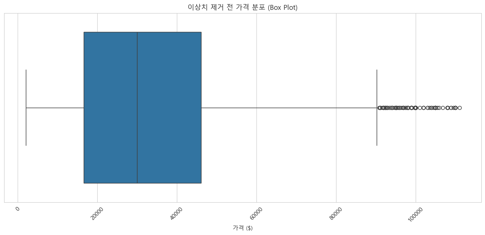

# ML_1
중고차 가격 예측 모델 개발

1. 프로젝트 개요 (Overview)
Kaggle의 중고차 데이터를 활용, 차량 특성 기반 가격 예측 회귀 모델 개발 및 평가.

단순 모델 구축을 넘어, 데이터 정제, 피처 엔지니어링, 모델링, 평가 등 머신러닝 전체 파이프라인 경험을 통한 문제 해결 능력 및 데이터 기반 논리적 사고 역량 증명을 목표로 함.

2. 개발 환경 및 사용 데이터
개발 환경: Python, Jupyter Notebook, VSCode

주요 라이브러리: Pandas, NumPy, Matplotlib, Seaborn, Scikit-learn

사용 데이터: Kaggle - Used Car Price Prediction Dataset(https://www.kaggle.com/datasets/taeefnajib/used-car-price-prediction-dataset)

3. 프로젝트 파이프라인 (Methodology)
본 프로젝트는 아래 단계로 진행. 특히 3단계 '이상치 처리'는 초기 모델의 문제를 해결하는 결정적 과정이었음.

데이터 탐색 (EDA): 데이터 기본 구조 및 통계적 특성 파악. boxplot과 histogram을 통한 가격 데이터 분포 시각화 및 탐색.

데이터 정제: price, milage 열의 불필요한 문자($, mi) 제거. 모델 학습을 위한 숫자형 데이터로 변환.

이상치 처리 (핵심 문제 해결 과정):

- 문제 발견: 초기 모델의 예측 오차(RMSE)가 $130,000 이상으로 비정상적으로 높게 나오는 문제점 식별.

- 원인 진단: 가격 데이터 분포 시각화를 통해, 소수의 초고가 차량 데이터(이상치)가 모델 학습을 심각하게 방해하고 있음을 확인.

- 해결: 가격 분포의 **상위 5%**에 해당하는 이상치 데이터 제거. 이를 통해 RMSE를 약 $8,700 수준으로 크게 개선하는 데 성공.

피처 엔지니어링: engine 열에서 horsepower, engine_L 등의 세부 정보 추출. model_year를 car_age라는 더 의미 있는 파생 변수로 생성.

결측치 처리: 모든 피처 엔지니어링 완료 후, 숫자형 데이터는 중앙값으로, 범주형 데이터는 최빈값으로 결측치 일괄 대체.

모델링 및 평가: LinearRegression, RandomForest, GradientBoosting 3가지 모델 학습. RMSE와 MAE를 기준으로 성능을 객관적으로 비교 분석하여 최적 모델 선정.

4. 핵심 결과 (Results)
최종 모델 성능 비교 (상위 5% 이상치 제거 후)

샘플 평균 가격: 약 $31,401

Model: Linear Regression	RMSE: $11,097.75 / MAE: $7,253.72
Model: Random Forest	    RMSE: $8,889.17	 / MAE: $5,736.28
Model: Gradient Boosting	RMSE: $8,766.52	 / MAE: $5,993.20

최종 결론: Random Forest 모델이 가장 낮은 MAE($5,736) 기록. 평균 약 18.3%의 오차율로 가장 현실적인 예측 성능을 보여줌.

5. 결론 및 고찰 (Conclusion & Reflection)
결론
데이터 정제 및 이상치 처리가 모델 성능에 미치는 결정적 영향 확인. 최종적으로 평균 18.3% 오차율의 성공적인 중고차 가격 예측 모델 구축 완료.

고찰 (What I Learned)
기록: GitHub를 통해 프로젝트 과정을 체계적으로 기록하고 문서화하는 것의 중요성을 깨달음.

문제 해결 능력: 예측 오차가 $130,000 이상으로 나온 초기 실패 상황에서, 데이터 시각화를 통해 '이상치'라는 문제의 원인을 직접 진단하고 해결하는 과정을 통해 데이터 기반의 문제 해결 능력 배양.

데이터 파이프라인의 중요성: 결측치 처리, 피처 엔지니어링, 인코딩의 논리적 순서의 중요성 및 잘못된 순서가 야기하는 오류를 직접 경험하며 체득.

평가 지표의 이해: RMSE와 MAE의 차이를 통해, 단순히 오차의 크기만이 아닌 모델이 어떤 종류의 실수(큰 실수 vs 작은 실수)를 하는지 다각적으로 평가하는 방법 학습.

향후 과제 (Future Work):
- GridSearchCV 등을 이용한 하이퍼파라미터 튜닝을 통해 모델을 더욱 정교하게 최적화하여 성능 추가 개선 계획.

- 현재 데이터에는 차량의 '사고 유무', '색상', '세부 옵션' 등 가격에 영향을 미칠 수 있는 중요 피처가 누락되어 있음. 
이러한 데이터가 추가된다면 모델의 예측 성능이 더욱 개선될 것.